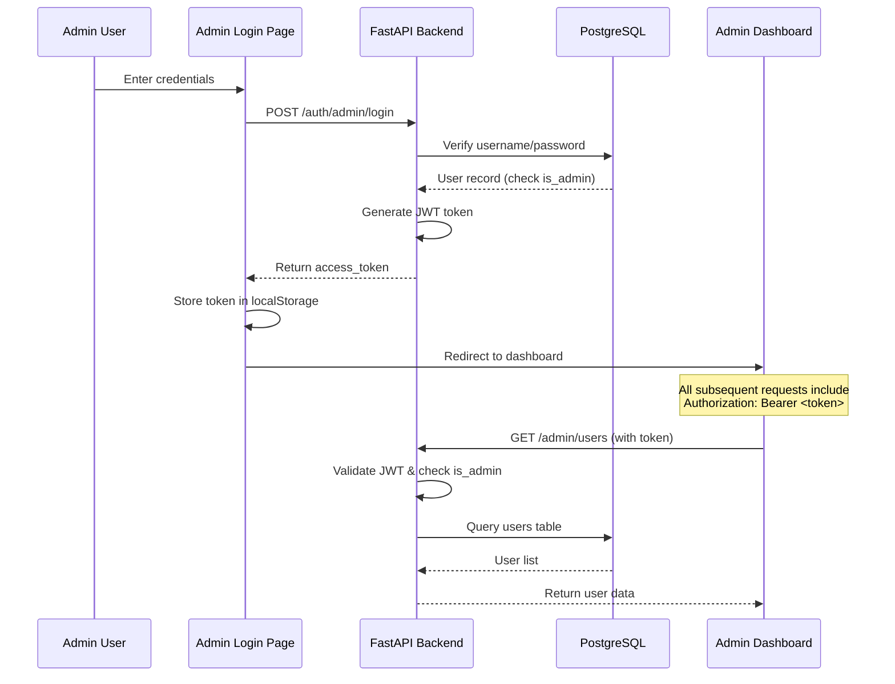
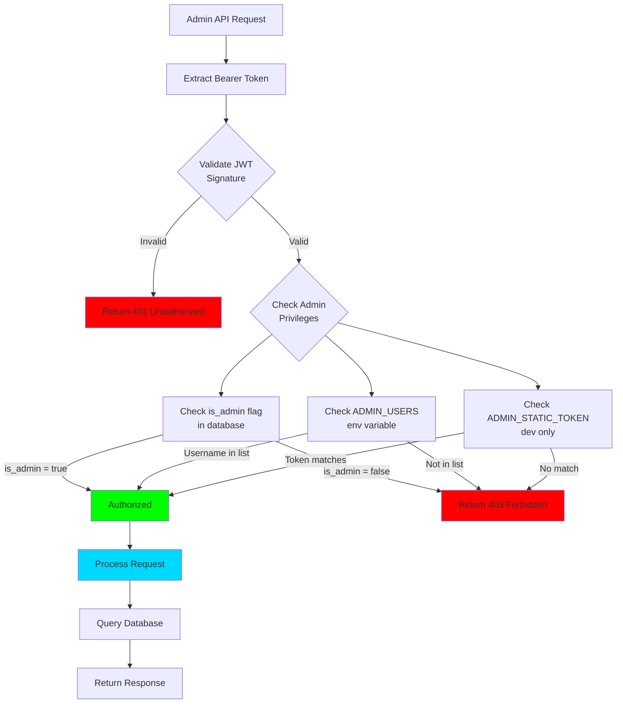
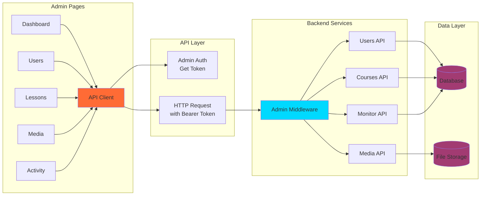

# Admin System Architecture (Mermaid)

## System Architecture Diagram

```mermaid
graph TB
    subgraph "Admin Frontend (Next.js/React)"
        LoginPage[Admin Login Page]
        AdminLayout[Admin Layout & Session Validator]
        Sidebar[Admin Sidebar]
        
        Dashboard[Dashboard Page]
        UsersPage[Users Management]
        LessonsPage[Lessons Management]
        MediaPage[Media Manager]
        ExercisesPage[Exercises]
        ActivityPage[Activity Monitor]
        
        AdminAuth[Admin Auth Utils]
        APIClient[API Client]
    end
    
    subgraph "Admin Backend (FastAPI)"
        CORS[CORS Middleware]
        
        AdminLogin[Admin Login Endpoint<br/>POST /auth/admin/login]
        JWTGen[JWT Token Generator]
        AdminAuthMW[Admin Auth Middleware]
        TokenValidator[Token Validator]
        
        UsersAPI[Users API<br/>GET /admin/users]
        CoursesAPI[Courses API<br/>/courses]
        MediaAPI[Media Upload API<br/>POST /courses/media/upload]
        MonitorAPI[Monitor API<br/>/admin/*]
        
        UserService[User Service]
        CourseService[Course Service]
        MediaService[Media Service]
        ActivityService[Activity Service]
    end
    
    subgraph "Database (PostgreSQL)"
        UsersTable[(users<br/>id, username, email<br/>hashed_password, is_admin)]
        CoursesTable[(courses<br/>id, name, level<br/>description, lesson_type)]
        LessonsTable[(lessons<br/>id, lesson_id, name<br/>course_id, video_url, order)]
        ActivityLogsTable[(activity_logs<br/>id, user_id, event_type<br/>detail, created_at)]
        EnrollmentsTable[(user_course_enrollments)]
        ProgressTable[(user_lesson_progress)]
    end
    
    subgraph "File Storage"
        MediaStorage[(media_uploads/<br/>Images & Videos)]
    end
    
    %% Frontend Flow
    LoginPage -->|Login| AdminLogin
    AdminLogin -->|Verify| UsersTable
    AdminLogin -->|Generate| JWTGen
    JWTGen -->|Return Token| LoginPage
    LoginPage -->|Store Token| AdminAuth
    
    AdminLayout -->|Validate| AdminAuth
    AdminLayout -->|Render| Sidebar
    Sidebar --> Dashboard
    Sidebar --> UsersPage
    Sidebar --> LessonsPage
    Sidebar --> MediaPage
    Sidebar --> ExercisesPage
    Sidebar --> ActivityPage
    
    Dashboard --> APIClient
    UsersPage --> APIClient
    LessonsPage --> APIClient
    MediaPage --> APIClient
    ActivityPage --> APIClient
    APIClient -->|Get Token| AdminAuth
    
    %% Backend API Calls
    APIClient -->|Bearer Token| UsersAPI
    APIClient -->|Bearer Token| CoursesAPI
    APIClient -->|Bearer Token| MediaAPI
    APIClient -->|Bearer Token| MonitorAPI
    
    %% Authorization
    UsersAPI --> AdminAuthMW
    CoursesAPI --> AdminAuthMW
    MediaAPI --> AdminAuthMW
    MonitorAPI --> AdminAuthMW
    
    AdminAuthMW --> TokenValidator
    TokenValidator -->|Check| UsersTable
    
    %% Business Logic
    UsersAPI --> UserService
    CoursesAPI --> CourseService
    MediaAPI --> MediaService
    MonitorAPI --> ActivityService
    
    %% Database Queries
    UserService --> UsersTable
    UserService --> EnrollmentsTable
    UserService --> ProgressTable
    CourseService --> CoursesTable
    CourseService --> LessonsTable
    MediaService --> MediaStorage
    MediaService --> LessonsTable
    ActivityService --> ActivityLogsTable
    ActivityService --> ProgressTable
    
    %% Database Relationships
    UsersTable -.->|FK| EnrollmentsTable
    UsersTable -.->|FK| ProgressTable
    UsersTable -.->|FK| ActivityLogsTable
    CoursesTable -.->|FK| LessonsTable
    CoursesTable -.->|FK| EnrollmentsTable
    LessonsTable -.->|FK| ProgressTable
    
    style LoginPage fill:#FF6B35
    style AdminLayout fill:#FF6B35
    style AdminLogin fill:#00D9FF
    style AdminAuthMW fill:#00D9FF
    style UsersTable fill:#A23B72
    style CoursesTable fill:#A23B72
    style LessonsTable fill:#A23B72
```

## Authentication Flow

## Authorization Flow

## Component Interaction

## Key Features

### 1. **Admin Authentication**
- JWT-based token authentication
- 24-hour session validity
- Secure token storage (localStorage)

### 2. **Admin Authorization**
- Multi-level privilege checking
- Database flag verification
- Environment variable support
- Development static token option

### 3. **Admin Pages**
- **Dashboard**: System overview and analytics
- **Users**: User account management
- **Lessons**: Course and lesson management
- **Media**: File upload and management
- **Exercises**: Exercise configuration
- **Activity**: Activity monitoring and logs

### 4. **Protected Endpoints**
- All admin endpoints require Bearer token
- Automatic token validation
- Graceful error handling

### 5. **Data Management**
- Full CRUD operations on courses/lessons
- User account viewing
- Media file uploads
- Activity log access

