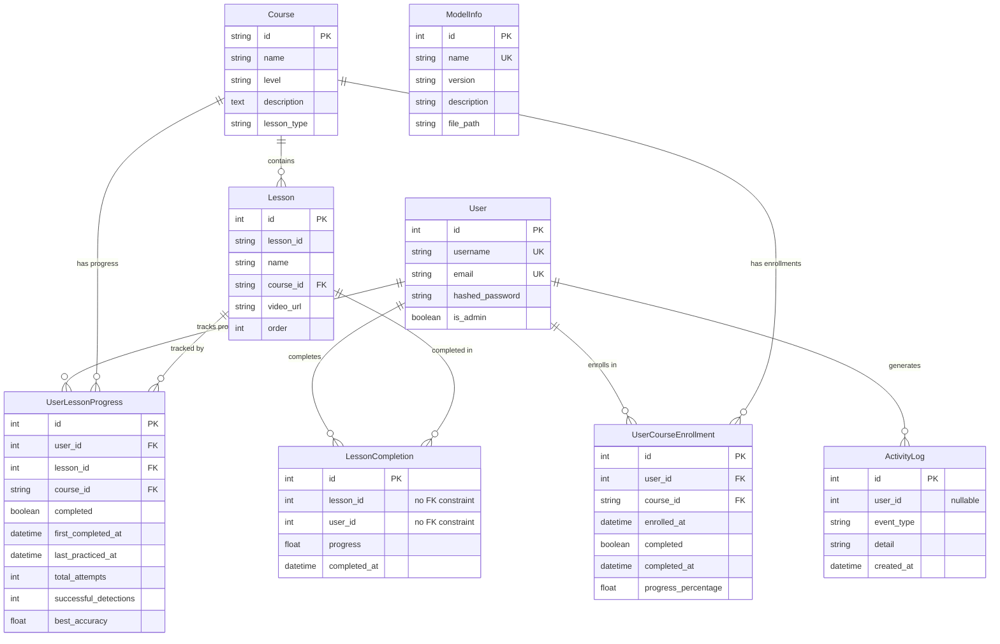

# Entity Relationship Diagram (ERD)

## Database Schema

## Entity Descriptions

### Core Entities

**User**
- Stores user account information
- Has admin flag for role-based access
- Related to enrollments, progress tracking, and activity logs

**Course**
- Represents a learning course (e.g., "Vietnamese Alphabet", "Greetings")
- Has a string ID as primary key
- Contains multiple lessons
- Has level and lesson_type attributes

**Lesson**
- Individual lessons within a course
- Has a lesson_id (e.g., "a", "hello") and display name
- Ordered within course using `order` field
- Contains video_url for reference material

### Relationship Entities

**UserCourseEnrollment**
- Many-to-many relationship between Users and Courses
- Tracks enrollment date, completion status, and progress percentage
- Links: User ↔ Course

**UserLessonProgress**
- Tracks detailed progress for each lesson attempt
- Records completion status, attempts, detections, and best accuracy
- Links: User ↔ Lesson ↔ Course

### Monitoring & Logging

**ActivityLog**
- Logs user activities (login, view_lesson, complete_lesson, etc.)
- user_id is nullable to allow system-level logging
- Timestamps all events

**LessonCompletion**
- Historical record of lesson completions
- Stores completion timestamp and progress value
- Note: No explicit foreign key constraints (legacy table)

### System Entities

**ModelInfo**
- Stores YOLO model metadata
- Tracks model name, version, description, and file path
- Used for machine learning model management

## Relationships Summary

1. **User → Course**: Many-to-many via `UserCourseEnrollment`
2. **User → Lesson**: Many-to-many via `UserLessonProgress`
3. **Course → Lesson**: One-to-many (direct relationship)
4. **User → ActivityLog**: One-to-many (user generates logs)
5. **User → LessonCompletion**: One-to-many (user completes lessons)
6. **Lesson → LessonCompletion**: One-to-many (lesson has completions)
7. **ModelInfo**: Standalone entity (no relationships)

