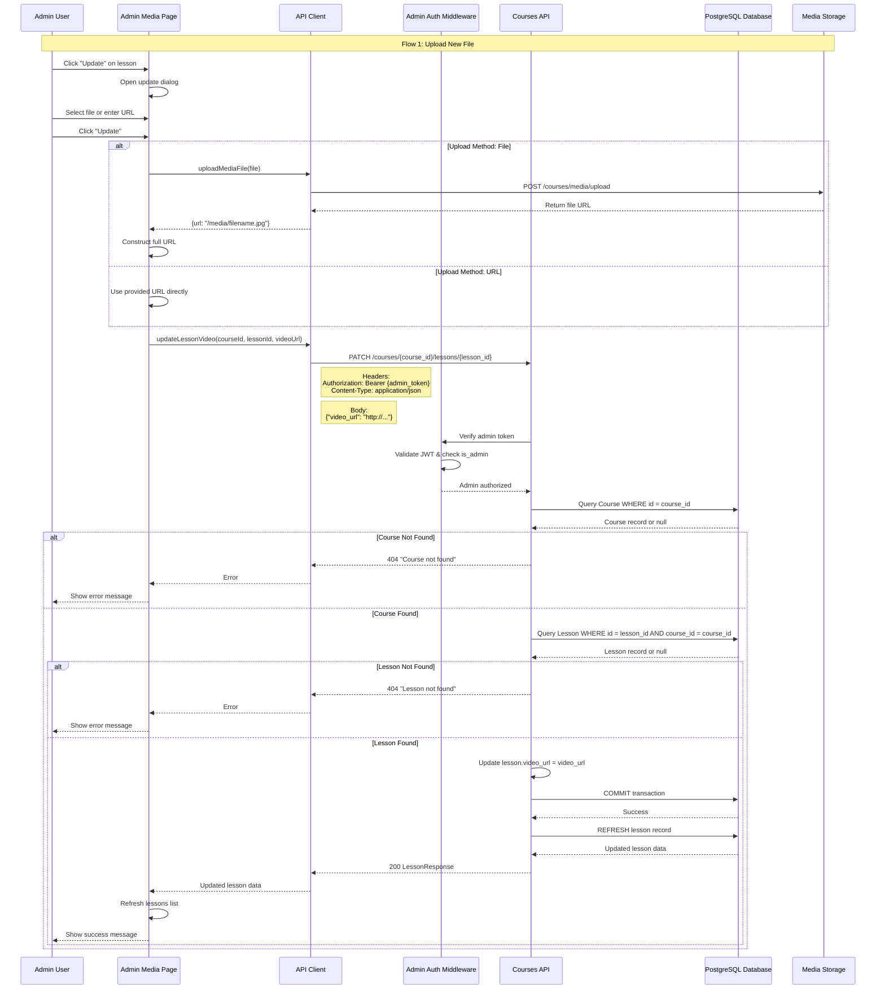

# Update Lesson Video Flow

## Overview
The `update_lesson_video` flow allows admins to update the reference video/image URL for a lesson. This can be done by either uploading a new file or providing a URL.

## Complete Flow Diagram



## Step-by-Step Flow

### 1. **Admin Initiates Update** (Frontend)
- Admin navigates to `/admin/media`
- Admin clicks "Update" button on a lesson
- Update dialog opens with current video URL (if any)

### 2. **Admin Provides Media** (Frontend)
Two methods available:

#### Method A: Upload File
```
Admin selects file
  ↓
MediaPage calls uploadMediaFile(file)
  ↓
POST /courses/media/upload (with admin token)
  ↓
Backend saves file to media_uploads/
  ↓
Returns: {url: "/media/20251229_104123_1.jpg"}
  ↓
MediaPage constructs full URL:
  http://127.0.0.1:8000/media/20251229_104123_1.jpg
```

#### Method B: Provide URL
```
Admin enters URL directly
  ↓
MediaPage uses URL as-is
  Example: "https://example.com/video.mp4"
```

### 3. **API Call** (Frontend → Backend)
```typescript
// Frontend API call
updateLessonVideo(
  courseId: "alphabet",
  lessonId: 1,
  videoUrl: "http://127.0.0.1:8000/media/file.jpg"
)
```

**HTTP Request:**
```
PATCH /courses/{course_id}/lessons/{lesson_id}
Headers:
  Authorization: Bearer {admin_token}
  Content-Type: application/json
Body:
  {
    "video_url": "http://127.0.0.1:8000/media/file.jpg"
  }
```

### 4. **Backend Processing**

#### Step 4.1: Admin Authentication
```python
_admin = Depends(get_current_admin)
```
- Extracts Bearer token from Authorization header
- Validates JWT token
- Checks `is_admin` flag in database
- Returns 401/403 if unauthorized

#### Step 4.2: Validate Course
```python
course = db.query(Course).filter(Course.id == course_id).first()
if not course:
    raise HTTPException(status_code=404, detail="Course not found")
```
- Queries `courses` table
- Returns 404 if course doesn't exist

#### Step 4.3: Validate Lesson
```python
lesson = db.query(Lesson).filter(
    Lesson.id == lesson_id,
    Lesson.course_id == course_id
).first()
if not lesson:
    raise HTTPException(status_code=404, detail="Lesson not found")
```
- Queries `lessons` table
- Validates lesson belongs to the specified course
- Returns 404 if lesson doesn't exist or doesn't belong to course

#### Step 4.4: Update Video URL
```python
if lesson_update.video_url is not None:
    lesson.video_url = lesson_update.video_url
```
- Updates the `video_url` field on the lesson object
- Only updates if `video_url` is provided (not None)

#### Step 4.5: Commit to Database
```python
db.commit()
db.refresh(lesson)
return lesson
```
- Commits the transaction
- Refreshes the lesson object to get latest data
- Returns updated lesson as `LessonResponse`

### 5. **Error Handling**

#### Course Not Found
```python
HTTPException(status_code=404, detail="Course not found")
```
- Transaction rolled back
- Error returned to frontend

#### Lesson Not Found
```python
HTTPException(status_code=404, detail="Lesson not found")
```
- Transaction rolled back
- Error returned to frontend

#### Database Error
```python
except Exception as e:
    db.rollback()
    raise HTTPException(status_code=500, detail=f"Database error: {str(e)}")
```
- Transaction rolled back
- Generic error returned

#### Authentication Error
- 401: Invalid or missing token
- 403: User is not admin

### 6. **Response** (Backend → Frontend)

**Success Response (200):**
```json
{
  "id": 1,
  "lesson_id": "a",
  "name": "A",
  "course_id": "alphabet",
  "video_url": "http://127.0.0.1:8000/media/file.jpg",
  "order": 0
}
```

**Error Responses:**
- 401: Unauthorized
- 403: Forbidden (not admin)
- 404: Course or Lesson not found
- 500: Database error

### 7. **Frontend Update** (After Success)
```typescript
// Refresh data
await fetchData()
setUpdateDialogOpen(false)
setSelectedLesson(null)
setFileInput(null)
setUrlInput("")
```
- Refreshes lessons list to show updated video URL
- Closes update dialog
- Clears form state
- Shows success message to admin

## Code Components

### Backend Endpoint
**File:** `backend/courses/routes.py`
```python
@router.patch("/{course_id}/lessons/{lesson_id}", response_model=LessonResponse)
def update_lesson_video(
    course_id: str,
    lesson_id: int,
    lesson_update: LessonUpdate,
    db: Session = Depends(get_db),
    _admin = Depends(get_current_admin)
):
```

### Request Schema
**File:** `backend/modules/schemas.py`
```python
class LessonUpdate(BaseModel):
    video_url: Optional[str] = None
```

### Frontend API Function
**File:** `frontend/lib/api.ts`
```typescript
export async function updateLessonVideo(
  courseId: string, 
  lessonId: number, 
  videoUrl: string
)
```

### Frontend Usage
**File:** `frontend/app/admin/media/page.tsx`
```typescript
await updateLessonVideo(
  selectedLesson.courseId, 
  selectedLesson.lessonId, 
  finalUrl
)
```

## Database Schema

**Table:** `lessons`
```sql
CREATE TABLE lessons (
    id INTEGER PRIMARY KEY,
    lesson_id VARCHAR NOT NULL,
    name VARCHAR NOT NULL,
    course_id VARCHAR NOT NULL,
    video_url VARCHAR,  -- This field is updated
    order INTEGER DEFAULT 0,
    FOREIGN KEY (course_id) REFERENCES courses(id)
);
```

## Security

1. **Admin-Only Access**
   - Protected by `get_current_admin` dependency
   - Requires valid admin JWT token
   - Verifies `is_admin` flag in database

2. **Input Validation**
   - Course ID and Lesson ID validated
   - Lesson must belong to specified course
   - Video URL is optional (can be None)

3. **Transaction Safety**
   - Database rollback on errors
   - Atomic updates
   - Data consistency maintained

## Use Cases

1. **Upload New Reference Video**
   - Admin uploads video file
   - File saved to `media_uploads/`
   - URL updated in database

2. **Change to External URL**
   - Admin provides external URL
   - Direct URL stored in database
   - No file upload needed

3. **Remove Video Reference**
   - Admin clears video URL
   - `video_url` set to `null`
   - Lesson still exists, just no reference

## Flow Summary

```
Admin Action
  ↓
Frontend: Upload file OR provide URL
  ↓
Frontend: Call updateLessonVideo()
  ↓
Backend: Verify admin authentication
  ↓
Backend: Validate course exists
  ↓
Backend: Validate lesson exists & belongs to course
  ↓
Backend: Update video_url field
  ↓
Backend: Commit to database
  ↓
Backend: Return updated lesson
  ↓
Frontend: Refresh data & show success
```

## Related Endpoints

- `POST /courses/media/upload` - Upload media file (used before update)
- `GET /courses/lessons/all` - Get all lessons (to refresh list)
- `GET /courses/{course_id}/lessons` - Get lessons for course


