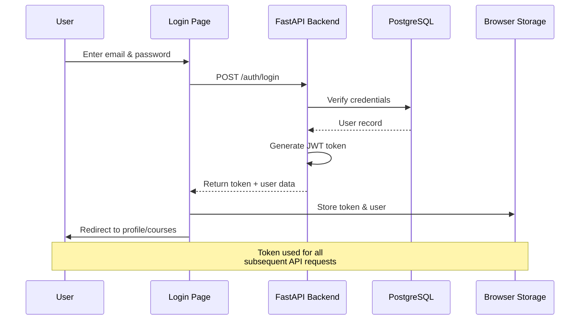
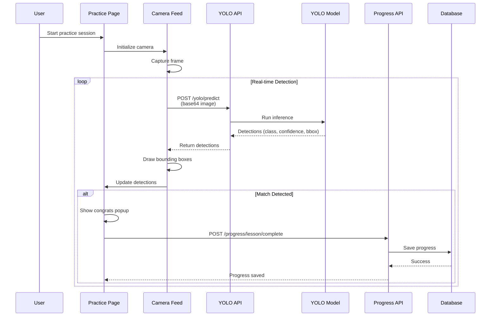
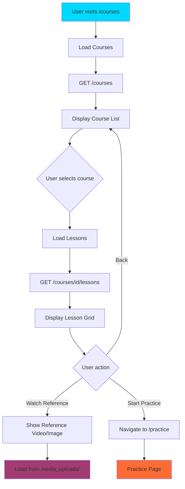
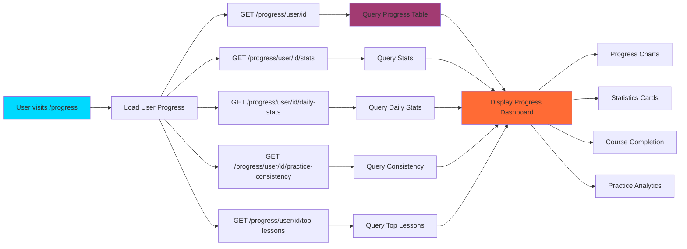
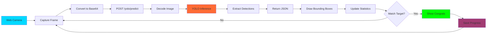
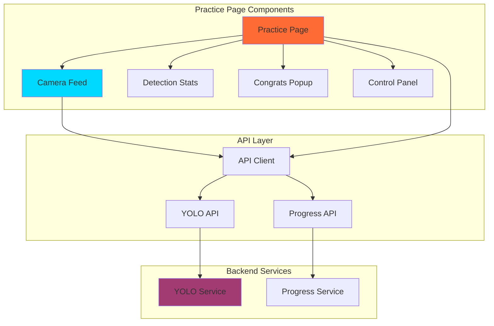

# User System Architecture (Mermaid)

## System Architecture Diagram

```mermaid
graph TB
    subgraph "User Frontend (Next.js/React)"
        LandingPage[Landing Page]
        Navbar[Navbar]
        
        LoginPage[Login Page]
        SignupPage[Signup Page]
        AuthUtils[Auth Utils]
        
        CoursesPage[Courses Page]
        PracticePage[Practice Page]
        ProgressPage[Progress Page]
        ProfilePage[Profile Page]
        
        CameraFeed[Camera Feed Component]
        DetectionStats[Detection Stats]
        ProgressChart[Progress Chart]
        CongratsPopup[Congrats Popup]
        
        APIClient[API Client]
        Analytics[Analytics]
    end
    
    subgraph "User Backend (FastAPI)"
        CORS[CORS Middleware]
        
        UserRegister[User Register<br/>POST /auth/register]
        UserLogin[User Login<br/>POST /auth/login]
        JWTGen[JWT Generator]
        TokenValidator[Token Validator]
        
        CoursesAPI[Courses API<br/>GET /courses]
        YOLOAPI[YOLO Prediction API<br/>POST /yolo/predict]
        ProgressAPI[Progress API<br/>/progress/*]
        ActivityLogger[Activity Logger]
        
        CourseService[Course Service]
        YOLOService[YOLO Service]
        ProgressService[Progress Service]
        AnalyticsService[Analytics Service]
        
        BrowserMediaAPI[Browser Media Device API]
    end
    
    subgraph "ML Model"
        YOLOModel[YOLO Model<br/>fullalphabet_yolo_v11s.pt]
    end
    
    subgraph "Database (PostgreSQL)"
        UsersTable[(users<br/>id, username, email<br/>hashed_password)]
        CoursesTable[(courses<br/>id, name, level<br/>description)]
        LessonsTable[(lessons<br/>id, lesson_id, name<br/>course_id, video_url)]
        EnrollmentsTable[(user_course_enrollments)]
        ProgressTable[(user_lesson_progress<br/>attempts, accuracy<br/>completions)]
        ActivityLogsTable[(activity_logs<br/>event_type, detail)]
    end
    
    subgraph "Storage"
        MediaStorage[(media_uploads/<br/>Videos & Images)]
    end
    
    subgraph "Browser"
        WebCamera[Web Camera API]
        LocalStorage[(localStorage<br/>Token & User Data)]
    end
    
    %% Navigation
    LandingPage --> Navbar
    Navbar --> LoginPage
    Navbar --> SignupPage
    Navbar --> CoursesPage
    Navbar --> PracticePage
    Navbar --> ProgressPage
    Navbar --> ProfilePage
    
    %% Authentication
    LoginPage --> APIClient
    SignupPage --> APIClient
    APIClient --> UserLogin
    APIClient --> UserRegister
    UserLogin --> JWTGen
    UserRegister --> JWTGen
    JWTGen --> LocalStorage
    AuthUtils --> LocalStorage
    
    %% Courses
    CoursesPage --> APIClient
    APIClient --> CoursesAPI
    CoursesAPI --> CourseService
    CourseService -.->|Query| CoursesTable
    CourseService -.->|Query| LessonsTable
    CoursesPage --> MediaStorage
    
    %% Practice Flow
    PracticePage --> CameraFeed
    CameraFeed --> WebCamera
    CameraFeed --> APIClient
    APIClient --> YOLOAPI
    YOLOAPI --> YOLOService
    YOLOService --> YOLOModel
    YOLOModel --> YOLOService
    YOLOService --> BrowserMediaAPI
    BrowserMediaAPI --> YOLOService
    YOLOService --> CameraFeed
    CameraFeed --> DetectionStats
    PracticePage --> CongratsPopup
    PracticePage --> APIClient
    APIClient --> ProgressAPI
    ProgressAPI --> ProgressService
    ProgressService --> ProgressTable
    PracticePage --> Analytics
    Analytics --> ActivityLogger
    ActivityLogger --> ActivityLogsTable
    
    %% Progress
    ProgressPage --> APIClient
    APIClient --> ProgressAPI
    ProgressAPI --> ProgressService
    ProgressService --> ProgressTable
    ProgressService --> EnrollmentsTable
    ProgressService --> ActivityLogsTable
    ProgressPage --> ProgressChart
    ProgressPage --> AnalyticsService
    
    %% Profile
    ProfilePage --> APIClient
    APIClient --> TokenValidator
    TokenValidator --> UsersTable
    
    %% Layout: Position Database to the right of Backend
    CORS -.->|" "| UsersTable
    
    %% Database Relationships
    UsersTable -.->|FK| EnrollmentsTable
    UsersTable -.->|FK| ProgressTable
    UsersTable -.->|FK| ActivityLogsTable
    CoursesTable -.->|FK| LessonsTable
    CoursesTable -.->|FK| EnrollmentsTable
    LessonsTable -.->|FK| ProgressTable
    
    style PracticePage fill:#FF6B35
    style CameraFeed fill:#FF6B35
    style YOLOModel fill:#00D9FF
    style YOLOAPI fill:#00D9FF
    style ProgressTable fill:#A23B72
    style CoursesTable fill:#A23B72
```

## User Authentication Flow

## Practice Session Flow

## Course Browsing Flow

## Progress Tracking Flow

## Real-Time Detection Pipeline

## Component Interaction

## Key Features

### 1. **Real-Time Sign Detection**
- Live camera feed with Web Camera API
- Real-time YOLO model inference
- Visual feedback with bounding boxes
- Accuracy scoring and statistics

### 2. **Progress Tracking**
- Lesson completion tracking
- Course enrollment management
- Practice statistics (attempts, accuracy)
- Practice consistency monitoring
- Top lessons analytics

### 3. **Interactive Learning**
- Reference videos/images for each lesson
- Structured course progression
- Practice sessions with real-time feedback
- Success celebrations on correct detection

### 4. **Analytics & Insights**
- Daily/weekly/monthly statistics
- Practice consistency tracking
- Top lessons practiced
- Progress visualization with charts
- Accuracy trends over time

## Data Flow Summary

1. **Authentication**: User credentials → JWT token → Stored in localStorage
2. **Course Browsing**: API call → Database query → Display courses/lessons
3. **Practice**: Camera frame → YOLO API → Detection results → Progress update
4. **Progress**: Multiple API calls → Database queries → Comprehensive dashboard

## Technology Integration

- **Frontend**: Next.js 14, React, TypeScript
- **Backend**: FastAPI, Python
- **ML**: YOLO (Ultralytics), OpenCV
- **Database**: PostgreSQL
- **Authentication**: JWT tokens
- **Storage**: Local filesystem for media

